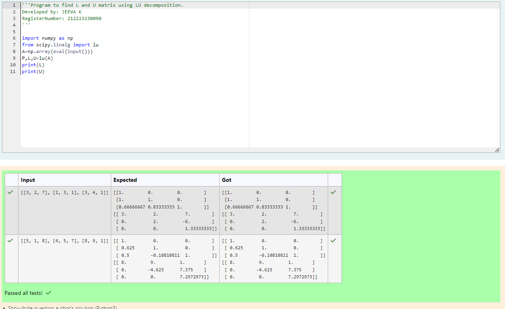
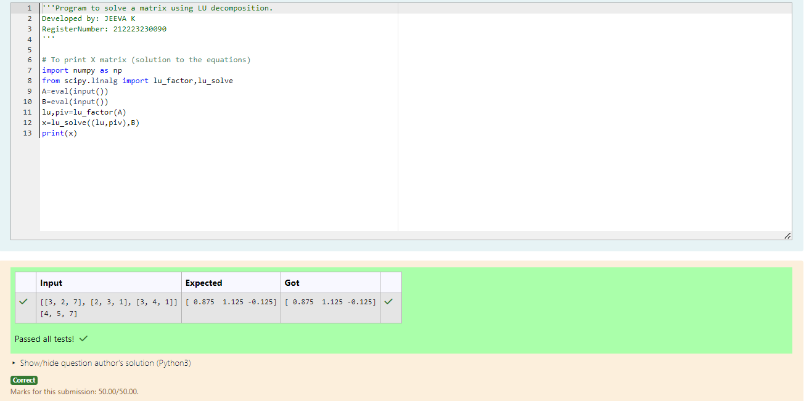

# LU Decomposition 

## AIM:
To write a program to find the LU Decomposition of a matrix.

## Equipments Required:
1. Hardware – PCs
2. Anaconda – Python 3.7 Installation / Moodle-Code Runner

## Algorithm
1. 
2. 
3. 
4. 

## Program:
(i) To find the L and U matrix
```c
/*
Program to find the L and U matrix.
Developed by: JEEVA K
RegisterNumber: 212223230090
*/
import numpy as np
from scipy.linalg import lu
A=np.array(eval(input()))
P,L,U=lu(A)
print(L)
print(U)

```
(ii) To find the LU Decomposition of a matrix
```c
/*
Program to find the LU Decomposition of a matrix.
Developed by: JEEVA K
RegisterNumber: 212223230090
*/
import numpy as np
from scipy.linalg import lu_factor,lu_solve
A=(eval(input()))
b=(eval(input()))
lu,piv=lu_factor(A)
x=lu_solve((lu,piv),b)
print(x)
```

## Output:
#### To print L and U matrix

#### To print X matrix (solution to the equations)


## Result:
Thus the program to find the LU Decomposition of a matrix is written and verified using python programming.

